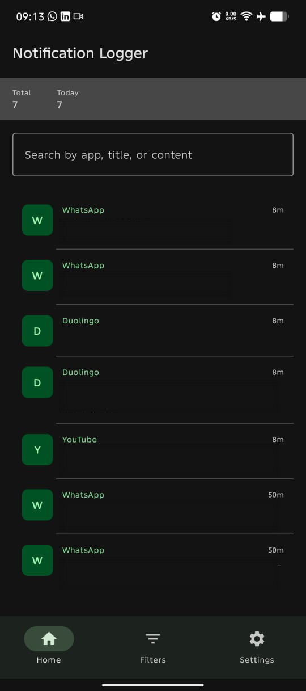
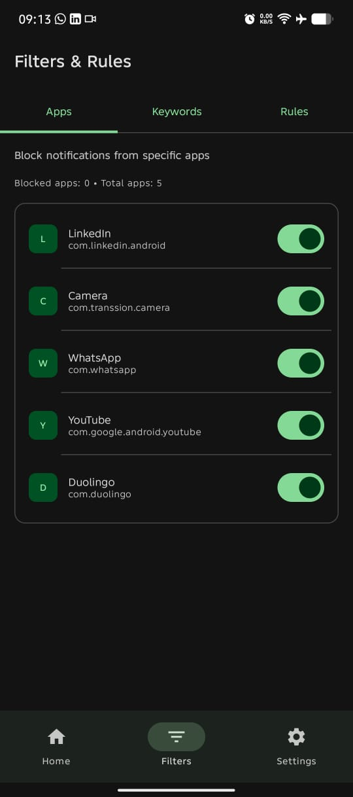
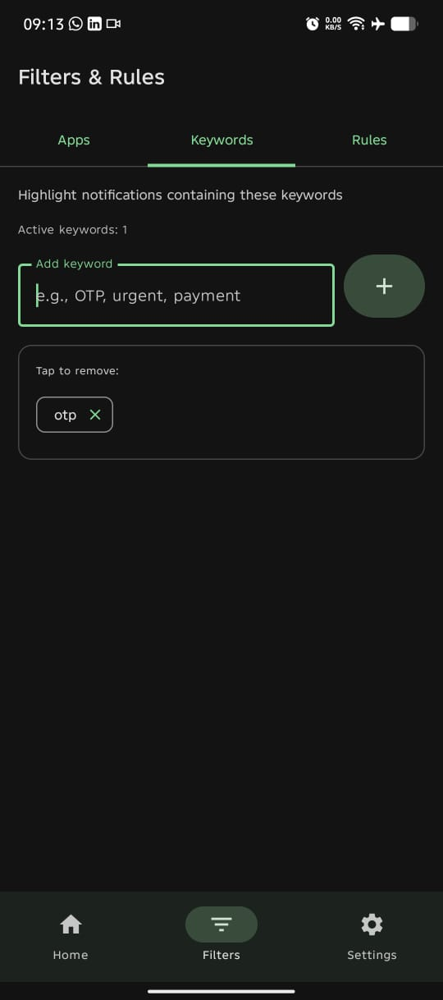
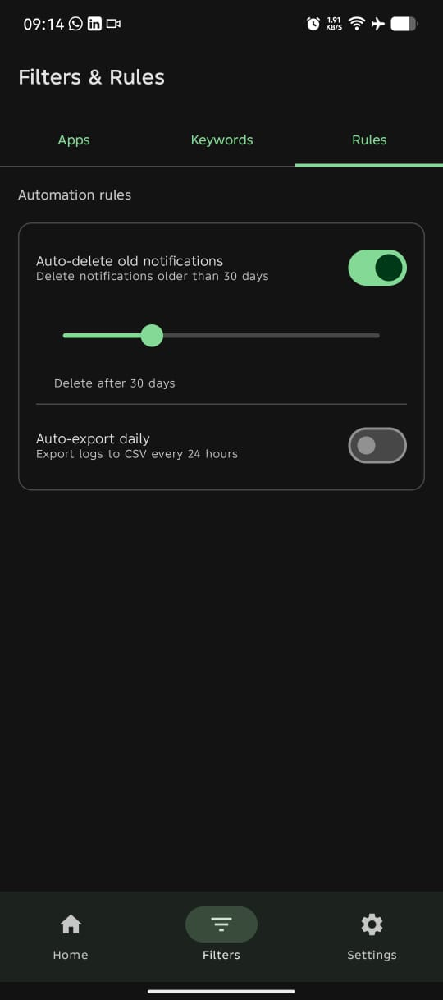
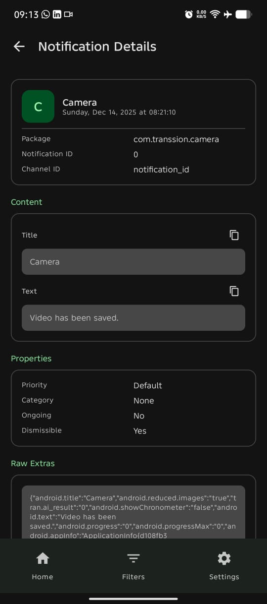
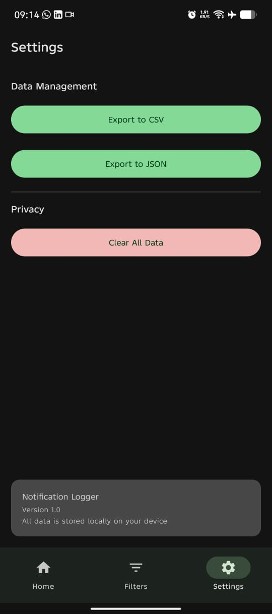
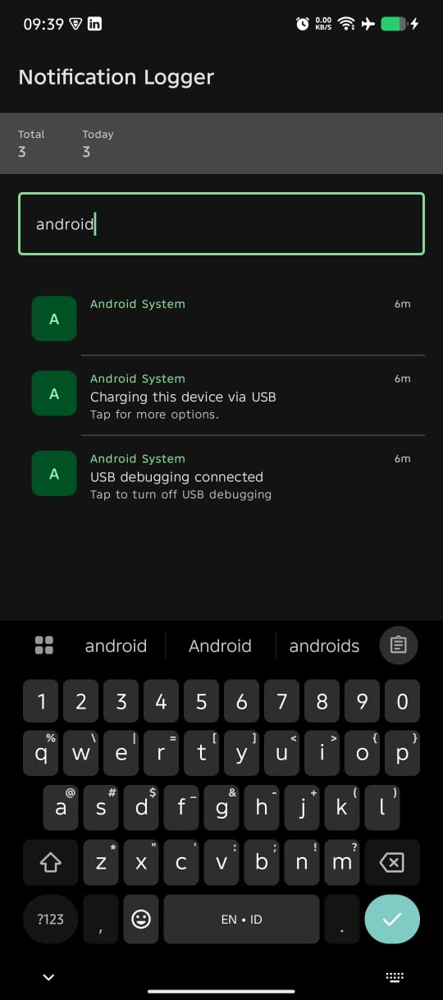

# 📱 Notification Logger

<div align="center">


**A modern Android application to log, track, and manage your device notifications with smart features like OTP detection, filtering, and data export.**

[Features](#-features) • [Screenshots](#-screenshots) • [Installation](#-installation) • [Usage](#-usage) • [Architecture](#-architecture) • [Contributing](#-contributing)

</div>

---

## 📖 Overview

Notification Logger is a powerful yet simple Android application built with modern Android development practices. It automatically logs all notifications received on your device, making it easy to:

- 🔍 Search through notification history
- 📤 Export data for backup or analysis
- 🎯 Filter out unwanted notifications

**Privacy First:** All data is stored locally on your device. No internet connection required. No tracking. No ads.

---

## ✨ Features

### 🎯 Core Features

- **Automatic Notification Logging**
  - Captures all notifications in real-time
  - Stores title, text, app name, timestamps, and metadata
  - Background service ensures no notification is missed

- **Advanced Search & Filtering**
  - Full-text search across all notification fields
  - Filter by specific applications
  - Highlight notifications with custom keywords
  - Block notifications from specific apps

### 📊 Data Management

- **Export Options**
  - Export to CSV for spreadsheet analysis
  - Export to JSON for data integration
  - Files saved to Downloads folder with timestamps

- **Auto-Delete Rules**
  - Automatically delete old notifications
  - Customizable retention period (7-90 days)
  - Manual clear all option

### 🎨 Modern UI/UX

- **Material 3 Design**
  - Clean, intuitive interface
  - Dark mode support
  - Smooth animations and transitions

- **Bottom Navigation**
  - Easy access to main features
  - Three tabs: Home, Filters, Settings

- **Detailed View**
  - Complete notification information
  - Copy any field with one tap
  - Expandable metadata

---

## 📸 Screenshots

<div align="center">

| Home Screen | Filter & Rules 1 | Filter & Rules 2 | Filter & Rules 3 |
|-------------|----------------|----------|----------|
|  |  |  |  |

| Notification Detail | Settings | Search |
|---------------------|---------------|--------|
|  |  |  |

</div>

---

## 🚀 Installation

### Prerequisites

- Android Studio Hedgehog | 2023.1.1 or later
- Android SDK 33 or higher
- Kotlin 1.9.22 or later

### Build from Source

1. **Clone the repository**
   ```bash
   git clone https://github.com/afandi-fa/notification-logger.git
   cd notification-logger
   ```

2. **Open in Android Studio**
   - Open Android Studio
   - Select "Open an Existing Project"
   - Navigate to the cloned directory

3. **Sync Gradle**
   - Android Studio will automatically sync Gradle
   - Wait for the sync to complete

4. **Run the app**
   - Connect your Android device or start an emulator
   - Click the "Run" button or press `Shift + F10`

### Download APK

Download the latest APK from the [Releases](https://github.com/afandi-fa/notification-logger/releases) page.

---

## 📱 Usage

### First Time Setup

1. **Install the app**
2. **Grant Notification Access**
   - The app will prompt you to enable notification access
   - Tap "Open Settings"
   - Find "Notification Logger" in the list
   - Toggle it ON
   - Return to the app

3. **Start Logging**
   - Notifications will now be logged automatically
   - Use the test notification button to verify it's working

### Main Features Usage

#### 📋 View Notifications
- Open the app to see all logged notifications
- Notifications are sorted by time (newest first)
- Tap any notification to see full details

#### 🔍 Search
- Use the search bar on the home screen
- Search by app name, title, or content
- Results update in real-time

#### 🎯 Filter by App
1. Go to "Filters" tab
2. Navigate to "Apps" section
3. Toggle OFF apps you want to block
4. Blocked notifications won't appear in your feed

#### 🔑 Highlight Keywords
1. Go to "Filters" tab
2. Navigate to "Keywords" section
3. Add keywords (e.g., "OTP", "urgent", "payment")
4. Notifications with these keywords will be highlighted

#### 📤 Export Data
1. Go to "Settings" tab
2. Tap "Export to CSV" or "Export to JSON"
3. File will be saved to Downloads folder
4. Check notification for file location

#### 🗑️ Auto-Delete
1. Go to "Filters" tab
2. Navigate to "Rules" section
3. Enable "Auto-delete old notifications"
4. Set retention period (7-90 days)

---

## 🏗️ Architecture

### Tech Stack

- **Language:** Kotlin
- **UI Framework:** Jetpack Compose
- **Architecture Pattern:** MVVM (Model-View-ViewModel)
- **Database:** Room
- **Async:** Coroutines + Flow
- **DI:** Manual dependency injection
- **Design:** Material 3

### Project Structure

```
app/
├── data/
│   ├── database/
│   │   ├── AppDatabase.kt
│   │   ├── NotificationDao.kt
│   │   └── NotificationEntity.kt
│   └── repository/
│       └── NotificationRepository.kt
├── service/
│   ├── NotificationListener.kt
│   └── ForegroundService.kt
├── ui/
│   ├── screens/
│   │   ├── NotificationFeedScreen.kt
│   │   ├── NotificationDetailScreen.kt
│   │   ├── FilterScreen.kt
│   │   ├── SettingsScreen.kt
│   │   └── StatusScreen.kt
│   ├── theme/
│   └── MainActivity.kt
├── utils/
│   ├── OTPDetector.kt
│   └── ClipboardUtils.kt
└── viewmodel/
    └── NotificationViewModel.kt
```

### Key Components

#### NotificationListenerService
- System service that receives all notifications
- Filters out blocked apps
- Stores to Room database

#### Room Database
- Single source of truth for notification data
- Provides reactive Flow API
- Efficient querying and filtering

#### ViewModel Layer
- Manages UI state
- Handles business logic
- Provides reactive data streams
- Manages user preferences

#### Compose UI
- Declarative UI components
- Material 3 design system
- Reactive updates via StateFlow

---

## 🔧 Configuration

### Minimum Requirements
- **Min SDK:** 33 (Android 13)
- **Target SDK:** 34 (Android 14)
- **Compile SDK:** 34

### Permissions Required
- `android.permission.BIND_NOTIFICATION_LISTENER_SERVICE` - To read notifications
- `android.permission.FOREGROUND_SERVICE` - For background service
- `android.permission.WRITE_EXTERNAL_STORAGE` - For export (Android 12 and below)

### Build Configuration

```gradle
android {
    compileSdk = 34
    defaultConfig {
        minSdk = 33
        targetSdk = 34
    }
    compileOptions {
        sourceCompatibility = JavaVersion.VERSION_17
        targetCompatibility = JavaVersion.VERSION_17
    }
}
```

---

## 📝 License

This project is licensed under the MIT License - see the [LICENSE](LICENSE) file for details.

```
MIT License

Copyright (c) 2024 [Your Name]

Permission is hereby granted, free of charge, to any person obtaining a copy
of this software and associated documentation files (the "Software"), to deal
in the Software without restriction, including without limitation the rights
to use, copy, modify, merge, publish, distribute, sublicense, and/or sell
copies of the Software, and to permit persons to whom the Software is
furnished to do so, subject to the following conditions:

The above copyright notice and this permission notice shall be included in all
copies or substantial portions of the Software.
```

---


</div>
